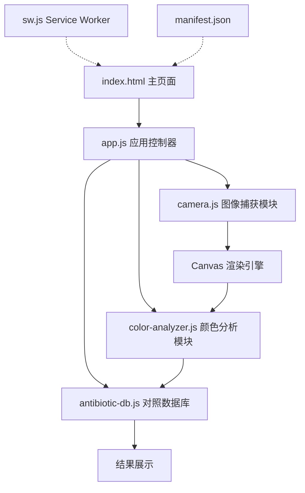

## 产品概述

一个面向牛奶中β-内酰胺类抗生素残留检测的移动端PWA应用。用户只需用手机拍摄比色试纸照片，点击试纸上的检测区域，应用即可自动提取该区域的RGB颜色值，并与预设的抗生素颜色对照表进行匹配，快速输出抗生素种类和浓度判断结果。应用支持添加到手机主屏幕，具备离线使用能力。

## 核心功能

- **拍照/选图**：调用手机相机实时拍照，或从相册选择已有试纸图片
- **区域选取**：在图片上通过触摸点击选取比色试纸的检测色块区域
- **RGB提取**：基于Canvas API读取选中区域的像素数据，计算平均RGB值
- **智能匹配**：将提取的RGB值与预设的β-内酰胺类抗生素颜色对照表进行欧几里得距离匹配，输出最接近的抗生素种类和对应浓度范围
- **结果展示**：清晰显示检测结果，包括抗生素名称、浓度区间、参考阈值，以及颜色对比可视化
- **PWA离线支持**：通过Service Worker实现离线缓存，可添加到手机主屏幕像原生APP一样使用

## 技术栈

- **前端框架**：纯 HTML5 + CSS3 + ES6 JavaScript（零依赖，无需构建工具）
- **图像处理**：Canvas API（像素级颜色提取）
- **相机调用**：MediaDevices.getUserMedia API + 文件上传回退
- **PWA能力**：Service Worker + Web App Manifest
- **UI风格**：移动端优先响应式设计，CSS变量主题系统

## 实现方案

### 整体策略

采用纯前端PWA架构，所有逻辑在浏览器端完成，无需后端服务器。应用分为四个核心模块：图像捕获模块、Canvas渲染与交互模块、颜色分析与匹配模块、PWA基础设施模块。

图像处理流程：用户拍照或选图 → 图片加载到Canvas → 用户点击/触摸检测区域 → 读取该区域像素数据 → 计算区域平均RGB → 与对照表进行欧几里得距离匹配 → 输出最佳匹配结果。

### 关键技术决策

**1. 颜色匹配算法：欧几里得距离**
选择RGB空间中计算欧几里得距离 `sqrt((R1-R2)² + (G1-G2)² + (B1-B2)²)` 作为颜色相似度度量。该方法简单直观、计算量小，在比色试纸这种颜色差异明显的场景下精度足够。设置距离阈值（建议阈值 ≤ 50），超过阈值则提示"未能匹配"。

**2. 区域颜色提取：邻域平均采样**
用户点击位置周围采样 5×5 像素区域，计算该区域的平均RGB值，消除单像素噪声干扰，提高检测稳定性。

**3. 图像缩放处理**
Canvas绘制时按比例缩放图片以适配屏幕，同时维护缩放比例映射，确保用户点击坐标能正确映射到原始图像像素位置。

**4. PWA策略：Cache First**
Service Worker采用Cache First策略，首次访问后缓存所有静态资源，后续访问直接使用缓存，实现离线可用。manifest.json配置全屏显示和手机主屏幕图标。

### 性能与可靠性

- **时间复杂度**：单次颜色匹配为 O(n)，n 为对照表条目数（约30-50条），实际耗时 < 1ms
- **内存占用**：Canvas只处理单张图片，内存峰值约 10-30MB
- **防抖处理**：触摸事件添加200ms防抖，避免快速连续点击
- **错误处理**：相机权限拒绝时自动降级为文件上传模式；图片加载失败给出明确提示

## 架构设计

### 系统架构

采用模块化单页应用架构，通过一个主控制器协调各功能模块：



### 数据流

```
用户拍照/选图 → 图像加载到Canvas → 用户触摸选取区域 
→ 提取5x5像素平均RGB → 对照表欧几里得距离匹配 
→ 找到最小距离对应的抗生素信息 → 渲染结果卡片
```

### 模块职责

- **app.js**：应用控制器，管理页面状态切换（拍照→选取→结果），协调各模块
- **camera.js**：封装相机调用（getUserMedia）和文件选择器，处理权限回退
- **color-analyzer.js**：Canvas像素读取、区域平均RGB计算、欧几里得距离匹配算法
- **antibiotic-db.js**：β-内酰胺类抗生素颜色对照表数据，包含抗生素名称、浓度范围、参考RGB、安全阈值
- **sw.js**：Service Worker，缓存静态资源，支持离线访问
- **manifest.json**：PWA配置，定义应用名称、图标、全屏显示模式

## 目录结构

```
c:/Users/28756/CodeBuddy/20260709171923/
├── index.html              # [NEW] 主页面。包含顶部标题栏、拍照/选图按钮区、Canvas画布区、检测结果展示区、底部操作栏。采用移动端优先的响应式布局，所有交互在单页内完成。
├── manifest.json           # [NEW] PWA清单文件。定义应用名称为"牛奶抗生素检测"，配置全屏显示模式(standalone)、主题色、图标路径。
├── sw.js                   # [NEW] Service Worker。实现Cache First缓存策略，缓存index.html、CSS、JS文件及图标资源，支持离线访问。
├── css/
│   └── style.css           # [NEW] 全局样式。使用CSS变量定义主题色系(蓝白科技医疗风格)，移动端优先的Flexbox布局，触摸友好的按钮尺寸(≥44px)，卡片式结果展示，平滑过渡动画。
├── js/
│   ├── app.js              # [NEW] 应用主控制器。管理应用状态机(INIT→IMAGE_LOADED→REGION_SELECTED→RESULT)，绑定UI事件，协调camera和color-analyzer模块。
│   ├── camera.js           # [NEW] 图像捕获模块。封装navigator.mediaDevices.getUserMedia调用相机(environment-facing后置摄像头)，提供文件选择回退方案，处理权限拒绝和浏览器兼容。
│   ├── color-analyzer.js   # [NEW] 颜色分析模块。负责Canvas图片渲染、触摸坐标转换、5x5邻域像素采样、区域平均RGB计算、基于欧几里得距离的颜色匹配算法。
│   └── antibiotic-db.js    # [NEW] 抗生素对照数据库。预设β-内酰胺类(青霉素类、头孢菌素类、碳青霉烯类等)常见检测指标的RGB参考值和浓度区间，支持通过管理函数动态扩展。
└── icons/
    ├── icon-192.png        # [NEW] 192x192 PWA图标(蓝色试剂瓶+检测线条样式)
    └── icon-512.png        # [NEW] 512x512 PWA图标
```

## 设计风格

采用**现代医疗科技风格**，融合Clean UI与轻量玻璃拟态(Glassmorphism)，营造专业、可信赖的检测工具氛围。

**主题定位**：专业医学检测工具，参考临床快检设备的视觉语言——简洁、高对比度、信息层级清晰。以蓝白为主色调传达科技感和洁净感，辅以翠绿色强调"检测通过/安全"语义，橙红色警示"超标/异常"。

**页面结构**（单页应用，分4个功能区块自上而下排列）：

### 区块1：顶部导航栏

固定在页面顶部，深蓝渐变背景(#1a237e → #283593)，白色文字。左侧显示应用名称"牛奶抗生素检测"，右侧显示PWA安装提示按钮。高度48px，底部带1px浅色阴影分隔。背景采用微妙的斜纹纹理增加质感。

### 区块2：图像捕获区

页面核心交互区，占据视口中央约55%高度。未捕获图像时显示虚线边框的占位区域，内有相机图标和"点击拍照或选择图片"提示文字。捕获后展示图片，图片上叠加半透明网格辅助对齐试纸。Canvas覆盖在img标签上方用于像素读取。该区域圆角16px，白色背景，外围8px浅蓝阴影，营造卡片悬浮感。

### 38：检测结果区

白色圆角卡片(12px圆角)，浅灰背景(#f5f7fa)。内部分三行展示：

- 第一行：抗生素名称（大号加粗深色字） + 匹配置信度百分比标签
- 第二行：浓度范围（中号蓝色字）+ 参考安全阈值
- 第三行：颜色对比条——左侧显示检测到的平均色块，右侧显示数据库参考色块，中间箭头连接
若匹配失败则显示橙色警告图标和"无法匹配，请重新选取检测区域"的引导文字。

### 区块4：底部操作栏

固定在页面底部，包含两个主要按钮——"重新拍照"(次要按钮，灰色描边)和"保存结果"(主要按钮，蓝色填充)。按钮高度48px，宽度各占50%，间距8px。底部留有safe-area-inset-bottom安全区适配刘海屏。

### 交互动效

- 按钮点击：scale(0.96) 按压反馈，150ms过渡
- 区域选取：选中位置出现涟漪扩散动画（蓝色半透明圆环，0.8s扩散至50px后消失）
- 结果卡片：从底部滑入(fadeInUp)，300ms ease-out
- 颜色对比条：加载时色块从左向右展开，500ms ease
- Canvas上检测区域标记：半透明蓝色圆形指示器，持续脉冲动画