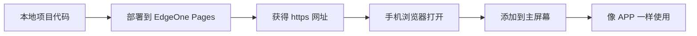
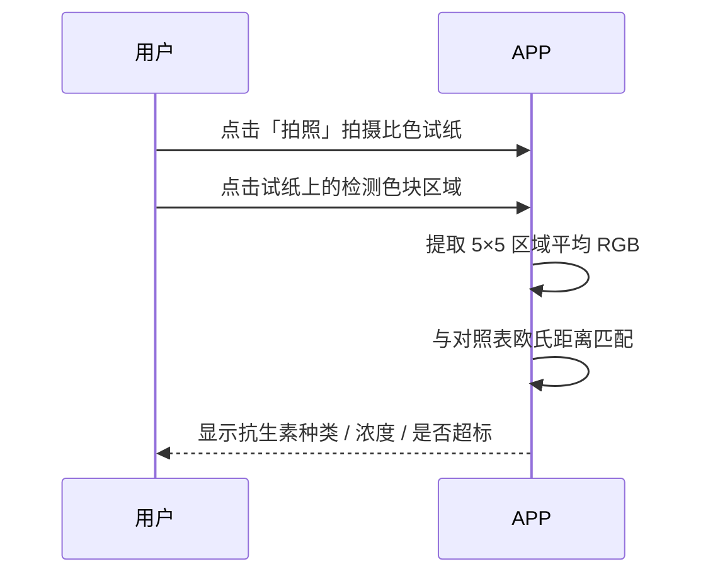

# 牛奶抗生素检测 · 部署与手机使用图文指南

> 本应用是一个 **PWA（渐进式 Web 应用）**，用手机浏览器打开后可「添加到主屏幕」，像原生 APP 一样全屏运行，并支持离线使用。

---

## 一、你需要知道的三个前提

| 事项 | 说明 |
|------|------|
| 🔒 **必须用 HTTPS** | 手机浏览器只有在 `https://` 或 `localhost` 环境下才允许调用相机。普通 `http://` 局域网地址无法拍照。 |
| 📲 **不用安装应用商店** | PWA 不通过 App Store / 应用商店分发，而是「用浏览器打开网址 → 添加到主屏幕」。 |
| 🎨 **需标定真实色卡** | `js/antibiotic-db.js` 里的 RGB 是占位模板值，正式检测前须用你的真实标准比色卡标定替换。 |

---

## 二、整体流程示意



---

## 三、部署到 EdgeOne Pages（推荐方式）

### 步骤 1：连接 EdgeOne Pages

1. 在 CodeBuddy 对话框中，点击顶部/左侧的 **「集成（Integration）」菜单**。
2. 找到 **EdgeOne Pages**，点击 **「连接 / 授权」**。
3. 按提示完成腾讯云账号登录授权。

> ✅ 授权成功后，集成状态会从 `disconnected` 变为已连接。

### 步骤 2：触发部署

- 在对话框中直接说：**「部署到 EdgeOne Pages」**。
- 系统会自动将当前项目目录（`index.html`、`css/`、`js/`、`icons/`、`manifest.json`、`sw.js`）打包发布。
- 部署完成后，你会获得一个形如 `https://xxxx.edgeonepages.com` 的 **HTTPS 网址**。

### 步骤 3：验证部署

在电脑浏览器打开该网址，确认页面正常显示（顶部「牛奶抗生素检测」标题、拍照/相册按钮、结果卡片区域）。

---

## 四、手机上打开并使用

### 方式 A：添加到主屏幕（最终形态，推荐）

#### 📱 iPhone（Safari）

1. 打开 Safari，访问部署得到的 `https://` 网址。
2. 点击底部中间的 **「分享」按钮**（⬆️ 方框箭头）。
3. 向上滑动，点击 **「添加到主屏幕」**。
4. 可修改名称（建议保留「牛奶抗生素检测」），点击右上角 **「添加」**。
5. 返回手机桌面，出现 APP 图标，**点击即全屏打开**。

#### 🤖 Android（Chrome）

1. 打开 Chrome，访问部署得到的 `https://` 网址。
2. 点击右上角 **「⋮」菜单** → 选择 **「安装应用」**（或「添加到主屏幕」）。
3. 确认安装，桌面即出现 APP 图标。
4. 点击图标，应用以全屏独立窗口运行。

> 💡 首次打开时浏览器可能弹出「可安装」提示横幅，直接点「添加」即可。

### 方式 B：直接用浏览器访问（临时查看）

不添加到主屏幕也能用：手机浏览器打开网址即可。但每次需从浏览器进入，体验略弱于主屏图标。

---

## 五、实际检测操作步骤



1. 将比色试纸放在光线均匀、纯色背景上。
2. 点击 **「拍照」**（优先调用后置摄像头）；若相机不可用，点 **「相册」** 选已有图片。
3. 照片出现后，画面提示「请点击试纸检测区域」。
4. **轻点试纸的检测色块**，出现涟漪动画与定位标记。
5. 下方结果卡片显示：
   - 抗生素名称 + 类别
   - 匹配置信度 %
   - 检测浓度 / 安全阈值 / 判定结果（合格 / 超标）
   - 颜色对比条（检测色 vs 参考色）
6. 点 **「保存结果」** 可将本次记录存入本地（最多 50 条）。
7. 点 **「重新检测」** 可换区域或重拍。

---

## 六、离线使用

由于已配置 Service Worker（`sw.js`，Cache First 策略）：

- 首次联网打开后，所有静态资源会被缓存。
- 之后**即使无网络**也能打开 APP 并进行颜色分析（分析在本地完成，无需服务器）。
- 注意：离线时无法重新部署或更新版本；更新需在联网时打开一次以刷新缓存。

---

## 七、⚠️ 关键：标定你的真实比色卡（务必做）

当前 `js/antibiotic-db.js` 中的 `rgb` 为**示意值**，不代表任何真实试纸。正式使用前必须标定：

1. 准备标准浓度样本试纸（如 0 / 4 / 8 / 16 / 32 μg/kg）。
2. 用本 APP 对每块标准色拍照并点击取样，记录显示的 RGB。
3. 将记录值替换进 `antibiotic-db.js` 对应条目的 `colorScale[].rgb`。
4. 重新部署，使新对照表生效。

数据库结构示例：

```javascript
{
  id: 'ampicillin',
  name: '氨苄西林',
  category: '青霉素类',
  threshold: '≤ 4 μg/kg',
  thresholdValue: 4,
  colorScale: [
    { concentration: 0,  unit: 'μg/kg', label: '阴性', rgb: [232, 240, 250] }, // ← 替换为真实值
    { concentration: 4,  unit: 'μg/kg', label: '4 μg/kg', rgb: [205, 224, 245] },
    // ...
  ]
}
```

---

## 八、常见问题（FAQ）

| 问题 | 原因 / 解决 |
|------|------------|
| 点「拍照」无反应 | 非 HTTPS 环境，浏览器禁用相机。请部署后用 `https://` 网址打开。 |
| 提示「未能匹配」 | 点击位置颜色与所有标准色差异过大（Δ 超阈值 55）。请点击试纸检测色块本身，或重新标定色卡。 |
| 相机被拒绝授权 | 在手机浏览器设置中允许该网站使用相机，或改用「相册」选图。 |
| 添加到主屏幕后仍是网页感 | 确认 `manifest.json` 的 `display: standalone` 已生效；iOS 需通过 Safari「添加到主屏幕」，第三方浏览器可能不支持。 |
| 换手机后记录没了 | 结果保存在原手机浏览器 `localStorage`，不跨设备同步。 |

---

## 九、本地预览（开发/自测）

项目已在本地启动服务：

```
http://localhost:8080
```

- 电脑浏览器打开可测试界面与离线缓存。
- 手机同一 WiFi 可用电脑局域网 IP（`http://192.168.x.x:8080`）查看**界面**，但相机受 HTTP 限制不可用。

---

> 📌 **总结**：部署（HTTPS）→ 手机浏览器打开 → 添加到主屏幕 → 标定色卡 → 拍照点选检测。三步即可在手机上拥有专属的牛奶抗生素快检 APP。
